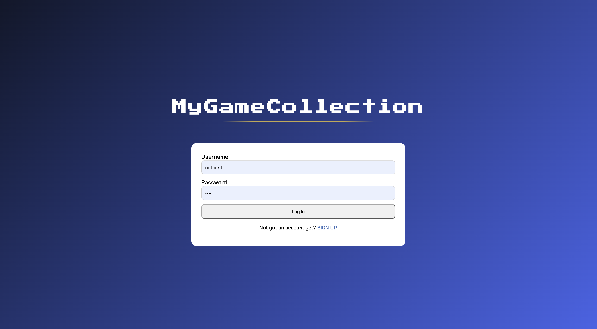
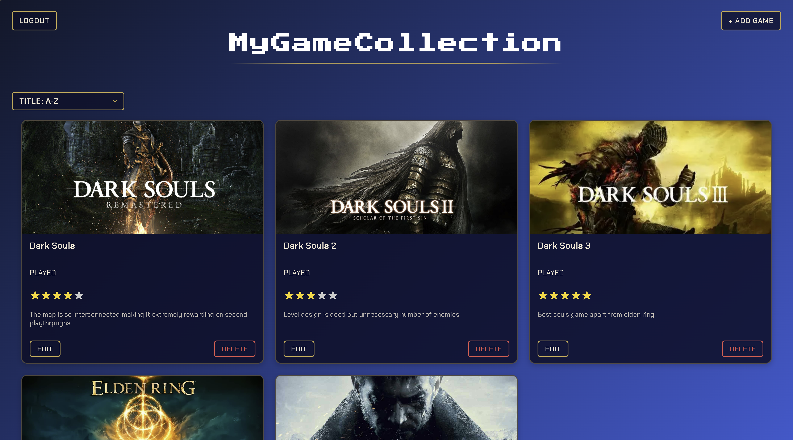

    # MyGameCollection

A web app for keeping track of the games I own and want to play. You can add a game with its cover art, mark it as played or want to play, give it a star rating and write a short review.

I built this to learn Spring Boot after doing my honours project (SQL Solver) in Node/Express. Some of the ideas carried over, but I wanted to see how the same things are done in Java.




## Built with

Java, Spring Boot, Spring Data JPA, PostgreSQL, and plain HTML/CSS/JavaScript for the frontend.

## What it does

- Register and log in (passwords are hashed with BCrypt)
- Add, edit and delete games in your collection
- Rate games out of 5 stars and write a review
- Sort by title or rating, or show only played / want to play games
- Each user can only see and change their own games

## Some things I learned

**Sessions and cookies.** When you log in the server stores your userId in a HttpSession and sends browser a session cookie. Cookie holds a random session ID, not userId. Frontends fetch calls send automatically (credentials: "include"), which is used to look up who you are. Since collection endpoints get user from session rather than request, you cannot view or edit someone elses games. Edit and delete also check the userGame entry belongs to you before doing anything, logging out invalidates session.

**DTOs.** The add and edit endpoints take request objects (`AddGameRequest`, `UpdateGameRequest`) instead of the entity directly, so a request can only set the fields it's supposed to. Adding a game is validated with `@Valid`.

**Sorting and filtering.** I initially tried writing a repository method for every combination of sort and filter, but the variety of potential combinations snowballed too quickly. Since the dropdown only allows one option at a time, the options are an enum (`CollectionView`), and a switch picks either `findByUserId(userId, Sort)` or `findByUserIdAndStatus(userId, status)`. Spring converts the query parameter straight into the enum and rejects anything invalid.

## Running it locally

You'll need Java and PostgreSQL.

1. Create a database:
   ```sql
   CREATE DATABASE gamecollection;
   ```
   Hibernate creates the tables on first run.

2. Set these environment variables:
   ```
   DB_URL=jdbc:postgresql://localhost:5432/gamecollection
   DB_USERNAME=postgres
   DB_PASSWORD=your_password
   ```

3. Run it:
   ```bash
   ./mvnw spring-boot:run
   ```
   or just run the main class from IntelliJ.

4. Go to http://localhost:8080 and make an account.

## API

| Method | Endpoint | |
|---|---|---|
| POST | `/api/users/register` | create an account |
| POST | `/api/users/login` | log in |
| POST | `/api/users/logout` | log out |
| GET | `/api/usergames/user/collection?view=TITLE_ASC` | your collection |
| POST | `/api/usergames` | add a game |
| PUT | `/api/usergames/{id}` | edit a game |
| DELETE | `/api/usergames/{id}` | delete a game |

`view` can be `TITLE_ASC`, `TITLE_DESC`, `RATING_ASC`, `RATING_DESC`, `PLAYED` or `WANT_TO_PLAY`.

## What's next

- Move the login over to Spring Security
- Proper error responses (401/403/404) instead of generic 500s
- Tests
- Search for games through the RAWG API so the cover and title fill in automatically
- Deploy it somewhere with a live link

    
